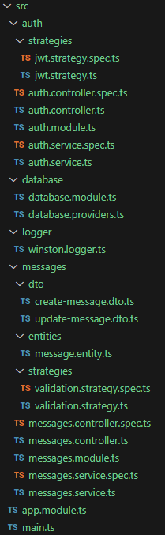
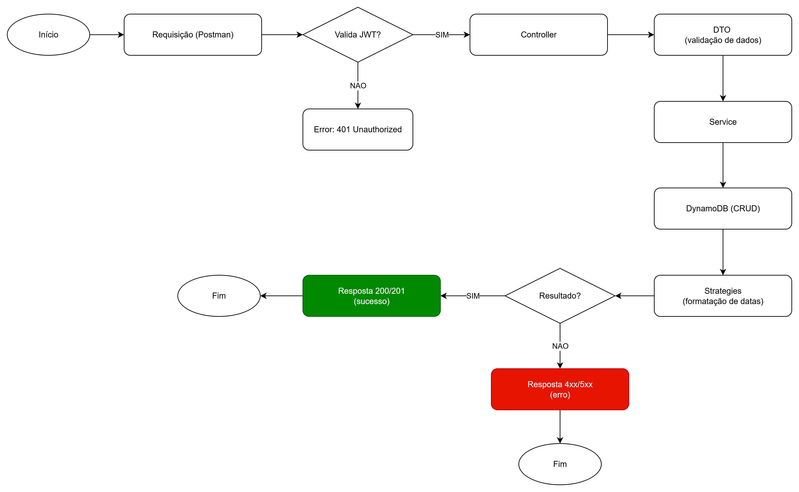
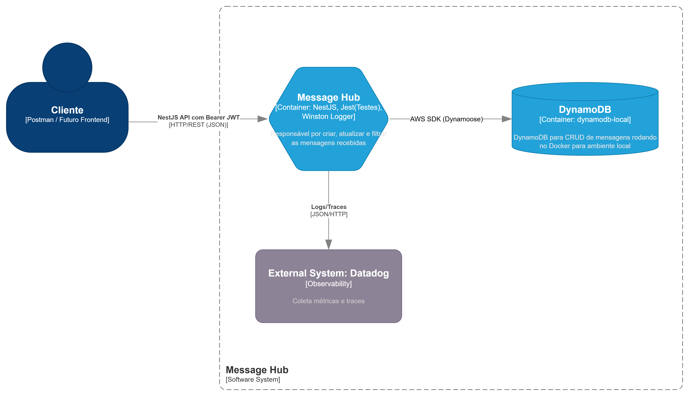

<p align="center">
  <a href="http://nestjs.com/" target="blank"></a>
</p>

[circleci-image]: https://img.shields.io/circleci/build/github/nestjs/nest/master?token=abc123def456
[circleci-url]: https://circleci.com/gh/nestjs/nest

  <p align="center">A progressive <a href="http://nodejs.org" target="_blank">Node.js</a> framework for building efficient and scalable server-side applications.</p>
    <p align="center">
<a href="https://www.npmjs.com/~nestjscore" target="_blank"></a>
<a href="https://www.npmjs.com/~nestjscore" target="_blank"></a>
<a href="https://www.npmjs.com/~nestjscore" target="_blank"></a>
<a href="https://circleci.com/gh/nestjs/nest" target="_blank"></a>
<a href="https://discord.gg/G7Qnnhy" target="_blank"></a>
<a href="https://opencollective.com/nest#backer" target="_blank"></a>
<a href="https://opencollective.com/nest#sponsor" target="_blank"></a>
  <a href="https://paypal.me/kamilmysliwiec" target="_blank"></a>
    <a href="https://opencollective.com/nest#sponsor"  target="_blank"></a>
  <a href="https://twitter.com/nestframework" target="_blank"></a>
</p>
  <!--[](https://opencollective.com/nest#backer)
  [](https://opencollective.com/nest#sponsor)-->

## Descrição
O Message Hub é uma API desenvolvida em NestJS com objetivo de centralizar a criação, listagem, atualização e filtragem de mensagens.
O projeto utiliza DynamoDB (emulado via Docker) como banco de dados, autenticação com JWT (fake), Winston para logs, Datadog para observabilidade e Jest para testes automatizados.

## Tecnologias Utilizadas
A arquitetura segue o padrão de camadas do NestJS, organizada em Controller → Service → Repository (DynamoDB) -> Strategy

- **NestJS**: Framework para construção da API.
- **DynamoDB Local (Docker)**: Banco de dados NoSQL utilizado para persistência das mensagens.
- **Dynamoose**: ODM para trabalhar com DynamoDB em Node.js.
- **JWT (Json Web Token)**: Autenticação simplificada para proteger os endpoints.
- **Winston**: Logger para auditoria e debugging.
- **Datadog**: Observabilidade (métricas e traces).
- **Jest**: Framework de testes unitários.
- **Docker Compose**: Orquestração do banco DynamoDB local.

## Executar a aplicação
1. **Pré-requisitos**
- Node (>= 18.20.2)
- Docker e Docker Compose
- NPM ou Yarn

2. **Clonar o repositório**
```bash
https://github.com/Jackeline2020/software-message-hub.git
cd software-message-hub
```

3. **Subir o DynamoDB local**
```bash
docker-compose up -d
```
O DynamoDB ficará disponível em http://localhost:8000

4. **Instalar dependências**
```bash
npm install
```

5. **Executar a aplicação**
```bash
npm run start:dev
```
A API estará disponível em http://localhost:3000

6. **Executar os testes**
```bash
npm run test
```

## Autenticação
A API utiliza JWT, exemplo de uso abaixo no Postman:

Adicione no header: Authorization: Bearer <seu-token>
Um token fake pode ser gerado via endpoint de login: http://localhost:3000/auth/login

## Docker Compose
docker-compose.yml

```bash
version: '3.8'

services:
 dynamodb-local:
   command: "-jar DynamoDBLocal.jar -sharedDb -dbPath ./data"
   image: "amazon/dynamodb-local:latest"
   container_name: dynamodb-local
   ports:
     - "8000:8000"
   volumes:
     - "./docker/dynamodb:/home/dynamodblocal/data"
   working_dir: /home/dynamodblocal
```

## Decisões Técnicas
- NestJS escolhido pela modularidade e boa integração com TypeScript.
- DynamoDB pela proposta de NoSQL escalável (emulado com Docker para desenvolvimento).
- Dynamoose facilita a abstração do banco sem precisar escrever chamadas brutas da SDK.
- JWT fake apenas para simular autenticação, garantindo controle de acesso aos endpoints.
- Winston + Datadog permitem logs estruturados e métricas, alinhados com boas práticas de observabilidade.
- Jest utilizado para garantir qualidade do código através dos testes.
- Docker Compose para que o ambiente seja facilmente replicável.

Estrutura de banco de dados
- forRoot: Configuração global do banco, onde inicializamos a conexão com o DynamoDB e registramos providers genéricos disponíveis para toda a aplicação.
- forFeature: Configuração específica de cada schema. Cada módulo importa apenas o que precisa, isso permite adicionar novas features sem alterar a configuração global, mantendo a aplicação escalável.

Schemas e Providers
- Cada schema possui providers específicos, encapsulando a lógica de acesso ao banco.

Índices e GSI
- Primary Key (PK/SK): estrutura de chave composta para consultas rápidas e filtragem por diferentes atributos.
- GSI (Global Secondary Index): usado para consultas alternativas sem precisar escanear toda a tabela.

## Estrutura de Pastas


## Diagramas
Fluxograma: descreve o fluxo de requisição até a resposta.


Diagrama de Arquitetura: mostra as tecnologias e a comunicação entre os componentes.
